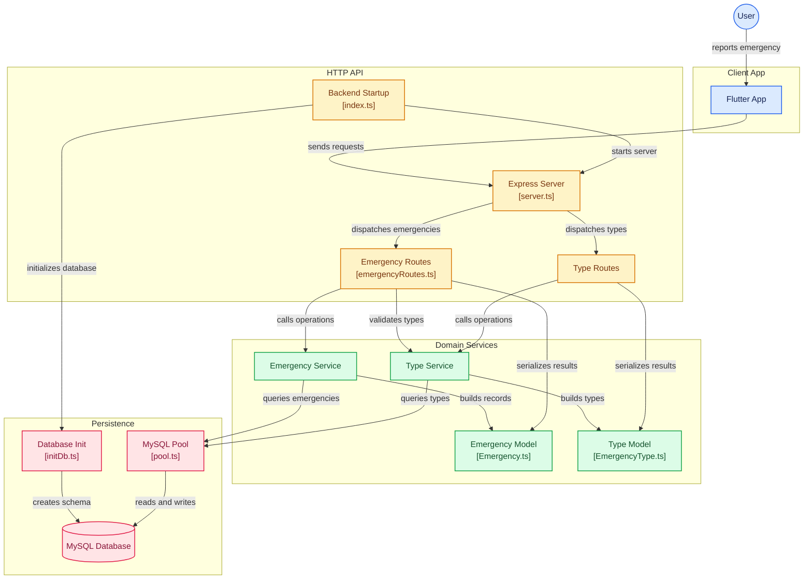

# Architecture

```mermaid
flowchart TD

subgraph group_client["Client App"]
  node_flutter_app["Flutter App"]
end

subgraph group_http["HTTP API"]
  node_backend_index["Backend Startup<br/>[index.ts]"]
  node_server["Express Server<br/>[server.ts]"]
  node_emergency_routes["Emergency Routes<br/>[emergencyRoutes.ts]"]
  node_type_routes["Type Routes"]
end

subgraph group_domain["Domain Services"]
  node_emergency_service["Emergency Service"]
  node_type_service["Type Service"]
  node_emergency_model["Emergency Model<br/>[Emergency.ts]"]
  node_type_model["Type Model<br/>[EmergencyType.ts]"]
end

subgraph group_persistence["Persistence"]
  node_db_init["Database Init<br/>[initDb.ts]"]
  node_pool["MySQL Pool<br/>[pool.ts]"]
  node_mysql[("MySQL Database")]
end

node_user(("User"))

node_user -->|"reports emergency"| node_flutter_app
node_flutter_app -->|"sends requests"| node_server
node_backend_index -->|"initializes database"| node_db_init
node_backend_index -->|"starts server"| node_server
node_server -->|"dispatches emergencies"| node_emergency_routes
node_server -->|"dispatches types"| node_type_routes
node_emergency_routes -->|"calls operations"| node_emergency_service
node_emergency_routes -->|"validates types"| node_type_service
node_type_routes -->|"calls operations"| node_type_service
node_emergency_service -->|"builds records"| node_emergency_model
node_type_service -->|"builds types"| node_type_model
node_emergency_service -->|"queries emergencies"| node_pool
node_type_service -->|"queries types"| node_pool
node_db_init -->|"creates schema"| node_mysql
node_pool -->|"reads and writes"| node_mysql
node_emergency_routes -->|"serializes results"| node_emergency_model
node_type_routes -->|"serializes results"| node_type_model

click node_backend_index "https://github.com/simonavel/emergency_app/blob/main/backend/src/index.ts"
click node_server "https://github.com/simonavel/emergency_app/blob/main/backend/src/server.ts"
click node_emergency_routes "https://github.com/simonavel/emergency_app/blob/main/backend/src/routes/emergencyRoutes.ts"
click node_type_routes "https://github.com/simonavel/emergency_app/blob/main/backend/src/routes/emergencyTypeRoutes.ts"
click node_emergency_service "https://github.com/simonavel/emergency_app/blob/main/backend/src/services/emergencyService.ts"
click node_type_service "https://github.com/simonavel/emergency_app/blob/main/backend/src/services/emergencyTypeService.ts"
click node_emergency_model "https://github.com/simonavel/emergency_app/blob/main/backend/src/models/Emergency.ts"
click node_type_model "https://github.com/simonavel/emergency_app/blob/main/backend/src/models/EmergencyType.ts"
click node_db_init "https://github.com/simonavel/emergency_app/blob/main/backend/src/database/initDb.ts"
click node_pool "https://github.com/simonavel/emergency_app/blob/main/backend/src/database/pool.ts"

classDef toneNeutral fill:#f8fafc,stroke:#334155,stroke-width:1.5px,color:#0f172a
classDef toneBlue fill:#dbeafe,stroke:#2563eb,stroke-width:1.5px,color:#172554
classDef toneAmber fill:#fef3c7,stroke:#d97706,stroke-width:1.5px,color:#78350f
classDef toneMint fill:#dcfce7,stroke:#16a34a,stroke-width:1.5px,color:#14532d
classDef toneRose fill:#ffe4e6,stroke:#e11d48,stroke-width:1.5px,color:#881337
classDef toneIndigo fill:#e0e7ff,stroke:#4f46e5,stroke-width:1.5px,color:#312e81
classDef toneTeal fill:#ccfbf1,stroke:#0f766e,stroke-width:1.5px,color:#134e4a
class node_flutter_app,node_user toneBlue
class node_backend_index,node_server,node_emergency_routes,node_type_routes toneAmber
class node_emergency_service,node_type_service,node_emergency_model,node_type_model toneMint
class node_db_init,node_pool,node_mysql toneRose
```
*[View original schema in gitgram](https://gitdiagram.com/simonavel/emergency_app)*