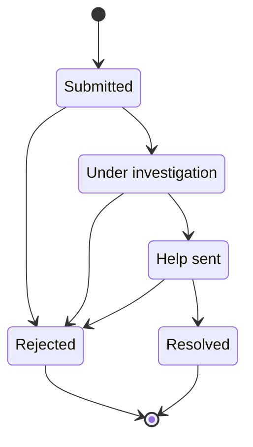

# Incident statuses
They are predefined. The specific emergency institution would decide what they are.
 

**Submitted**
- The default state. No actions have been taken, except for the submission of the report by a user.

**Under investigation**
- An operator has taken on the task of investigating this report. Their job is to decide whether further assistance should be provided.

**Help sent**
- An operator has contacted the responsible institution (e.g. *fire department, emergency medical services, police department*)

**Resolved**
- The responsible institution has sent help.

**Rejected**
- Emergency has been resolved by the time the report is made. (under investigation -> rejected)
- Emergency does not exist (e.g. *prank calls*). (submitted -> rejected)
- Emergency is already in "Help sent" state. (help sent -> rejected)

## Diagram
